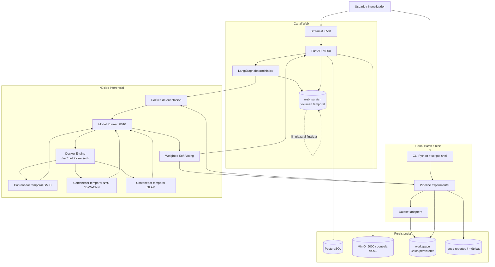
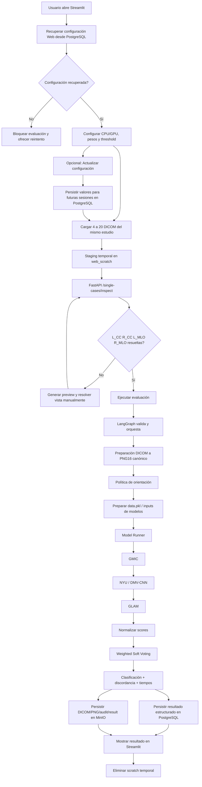
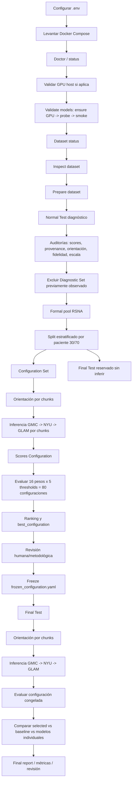
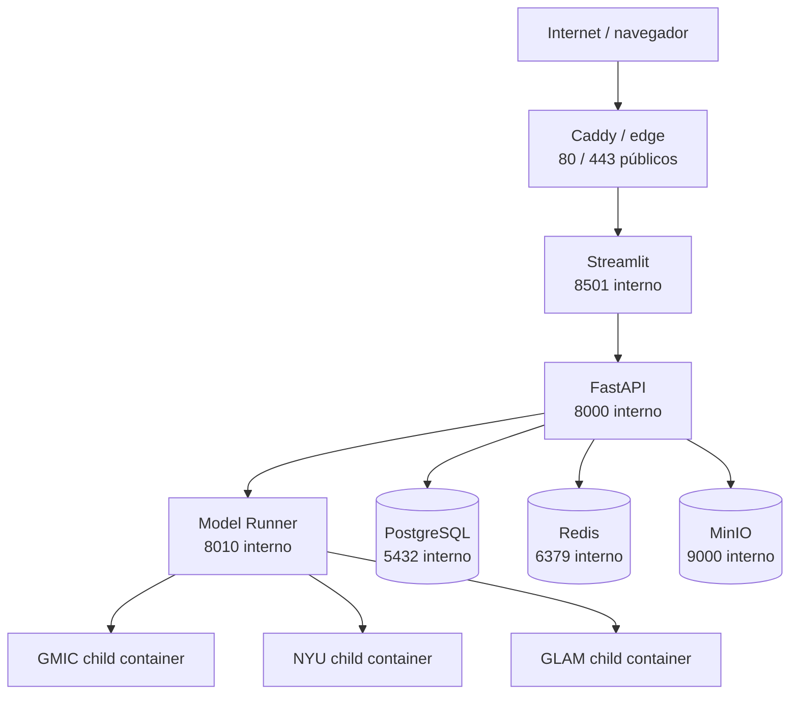
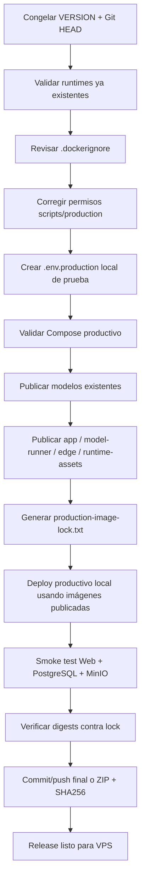

# Mammography AI Agent

**Versión:** 0.35.3 — corrección de persistencia Web entre upgrades  
**Propósito:** prototipo de tesis de maestría para inferencia mamográfica con **GMIC + DMV-CNN/NYU + GLAM** y combinación mediante **Weighted Soft Voting**.

> **Uso exclusivo de investigación.** Este software no es un dispositivo médico, no sustituye la evaluación de un radiólogo y sus resultados no constituyen un diagnóstico clínico.

## Contenido

1. [Explicación de la funcionalidad](#1-explicación-de-la-funcionalidad)
2. [Diagrama de arquitectura](#2-diagrama-de-arquitectura)
3. [Explicación de la arquitectura](#3-explicación-de-la-arquitectura)
4. [Estructura del proyecto](#4-estructura-del-proyecto)
5. [Clases y módulos de código principales](#5-clases-y-módulos-de-código-principales)
6. [Scripts operativos](#6-scripts-operativos)
7. [Flujo Web](#7-flujo-web)
8. [Flujo Batch](#8-flujo-batch)
9. [Dockerfiles y Docker Compose](#9-dockerfiles-y-docker-compose)
10. [Ejecución completa del proceso Batch](#10-ejecución-completa-del-proceso-batch)
11. [Ejecución y configuración del flujo Web](#11-ejecución-y-configuración-del-flujo-web)
12. [Configuración, persistencia y artefactos](#12-configuración-persistencia-y-artefactos)
13. [Limitaciones y reglas metodológicas](#13-limitaciones-y-reglas-metodológicas)
14. [Documentación adicional](#14-documentación-adicional)

---

# 1. Explicación de la funcionalidad

## 1.1 Objetivo funcional

El proyecto implementa un agente de IA para investigación en mamografía que ejecuta tres modelos de deep learning previamente entrenados:

- **GMIC**.
- **DMV-CNN / NYU Breast Cancer Classifier**.
- **GLAM**.

Cada modelo produce un score de malignidad. El sistema transforma esos scores a una representación canónica por estudio y calcula un score combinado mediante **Weighted Soft Voting**:

```text
ensemble_score =
    gmic_score * w_gmic
  + nyu_score  * w_nyu
  + glam_score * w_glam
```

Los pesos deben sumar `1.0`. La clasificación binaria se obtiene con un umbral:

```text
si ensemble_score >= threshold  -> CANCER
si ensemble_score <  threshold  -> NO CANCER
```

Los scores se utilizan como scores experimentales de malignidad y **no deben interpretarse como probabilidades clínicas calibradas**.

## 1.2 Dos modos de ejecución

El proyecto tiene dos canales independientes que reutilizan la misma lógica inferencial central:

### Flujo Web

Orientado a evaluar **un estudio individual** desde Streamlit. El usuario carga archivos DICOM, revisa las proyecciones, configura dispositivo/pesos/threshold Web y ejecuta la inferencia. La ruta Web:

- no recibe `train.csv` ni ground truth;
- no modifica los YAML del proceso Batch;
- usa un scratch temporal separado del `workspace` Batch;
- persiste resultados estructurados en PostgreSQL;
- persiste artefactos compactos en MinIO;
- limpia los archivos temporales del caso al finalizar.

### Flujo Batch

Orientado a la tesis, validación de modelos, análisis de datasets y experimento formal. Permite:

- inspección y preparación reproducible de datasets;
- pruebas diagnósticas pequeñas;
- auditorías de orientación, scores y preprocessing;
- validación de los runtimes reales de GMIC, NYU y GLAM;
- división formal Configuration Set / Final Test;
- inferencia resumible por chunks;
- evaluación de combinaciones de pesos y thresholds;
- freeze de la configuración seleccionada;
- evaluación final sobre el Final Test reservado.

## 1.3 Lo que el sistema no hace

El prototipo:

- **no entrena** GMIC, NYU ni GLAM;
- no hace fine-tuning, LoRA ni nuevas classifier heads;
- no usa LLM ni RAG para producir scores;
- no usa APIs externas de IA para inferencia;
- no genera predicciones simuladas cuando un modelo falla;
- no usa MinIO ni PostgreSQL dentro del cálculo matemático del ensemble;
- no permite que la configuración Web modifique la configuración experimental Batch.

## 1.4 Entrada mamográfica canónica

El ensemble requiere cuatro proyecciones estándar por estudio:

- `L_CC`
- `R_CC`
- `L_MLO`
- `R_MLO`

En datasets preparados, estas vistas se registran en el manifest canónico. En Web, se obtienen a partir de metadata DICOM y, cuando la proyección no puede resolverse automáticamente, la interfaz permite una asignación manual supervisada.

## 1.5 Datasets soportados

El catálogo actual incluye:

| Dataset | Clave | Adquisición | Uso principal |
|---|---|---|---|
| RSNA Screening Mammography Breast Cancer Detection | `rsna` | Manual | Dataset principal del experimento formal actual |
| CBIS-DDSM | `cbis_ddsm` | Manual TCIA | Validación/adaptación histórica |
| CMMD | `cmmd` | Manual TCIA | Validación de adapter y dominio adicional |
| VinDr-Mammo | `vindr` | Manual PhysioNet | Declarado en catálogo; requiere adquisición autorizada |

Docker no descarga estos datasets automáticamente al levantar la plataforma.

---

# 2. Diagrama de arquitectura



---

# 3. Explicación de la arquitectura

## 3.1 Streamlit

`ui/streamlit_app.py` implementa la interfaz Web. Sus responsabilidades principales son:

- carga de DICOM;
- staging temporal de archivos;
- consulta del estado de modelos y persistencia;
- configuración Web de CPU/GPU, pesos y threshold;
- persistencia explícita de la configuración Web mediante el botón **Actualizar configuración**;
- inspección automática de lateralidad/proyección;
- resolución manual cuando CC/MLO no puede identificarse;
- ejecución del caso;
- polling del progreso;
- visualización de scores, tiempos, orientación y artefactos.

Streamlit no llama directamente a los modelos. Toda inferencia se envía a FastAPI.

## 3.2 FastAPI

`mammography_agent/api.py` es el backend de aplicación. Expone:

- health y estado del workspace;
- operaciones sobre datasets;
- inspección y previews de casos DICOM;
- ejecución Web unitaria;
- progreso por `run_id`;
- configuración del ensemble Web;
- lectura/escritura de configuración Web persistida;
- estado de PostgreSQL/MinIO.

La ruta `/single-cases/run` usa LangGraph como máquina de estados determinística y delega la inferencia real a `mammography_agent.single_case.run_single_case()`.

## 3.3 LangGraph

`mammography_agent/graph.py` define un grafo mínimo:

1. valida la solicitud;
2. ejecuta el handler inferencial;
3. devuelve el resultado.

LangGraph **no decide clínicamente**, no genera texto y no sustituye los modelos. Se utiliza únicamente para orquestar de forma explícita el estado de la solicitud Web.

## 3.4 Pipeline Batch

`mammography_agent/pipeline.py` contiene el flujo principal de tesis:

- carga de manifests;
- sampling diagnóstico;
- resolución de orientación;
- ejecución de los tres modelos;
- normal test;
- exclusiones formales;
- split Configuration / Final Test;
- inferencia por chunks resumibles;
- evaluación de configuraciones;
- freeze;
- evaluación final.

El Batch se ejecuta dentro del contenedor `fastapi` mediante `docker compose exec fastapi python -m ...`; no entra por la API HTTP de la ruta Web.

## 3.5 Model Runner

`model_runner/api.py` es una frontera técnica entre la aplicación y los runtimes ML. El Model Runner:

- no contiene PyTorch/TensorFlow/CUDA;
- accede al Docker Engine mediante `/var/run/docker.sock`;
- prepara o reutiliza imágenes de modelo;
- crea contenedores temporales de inferencia;
- monta inputs/outputs;
- aplica el dispositivo solicitado;
- registra métricas de recursos;
- serializa uso de GPU mediante lock compartido;
- elimina el contenedor temporal después de la ejecución.

La separación evita mezclar dependencias incompatibles de GMIC, NYU y GLAM en un único entorno Python.

## 3.6 Runtimes de modelos

Las imágenes de inferencia son independientes:

- `mammography-model-gmic:research` o runtime GPU compatible;
- `mammography-model-nyu:research` o runtime GPU compatible;
- `mammography-model-glam:research` o runtime GPU compatible.

Para NVIDIA Blackwell, los Dockerfiles de `docker/model-compat/` usan PyTorch 2.7.1 + CUDA 12.8 y aplican únicamente parches de compatibilidad explícitos. Los commits upstream, checkpoints y arquitectura de los modelos permanecen congelados.

## 3.7 Ensemble

`mammography_agent/ensemble/soft_voting.py` recibe los tres scores canónicos y calcula:

- score ponderado;
- clasificación según threshold;
- rango entre modelos;
- desviación estándar;
- indicador de discordancia.

La configuración base reside en `config/ensemble.yaml`.

## 3.8 Persistencia Web

La ruta Web separa tres tipos de almacenamiento:

- **PostgreSQL:** resultados estructurados, configuración aplicada y configuración Web persistida.
- **MinIO:** DICOM originales, PNG canónicos y artefactos compactos del run.
- **web_scratch:** staging y archivos intermedios temporales; se eliminan al terminar.

El `workspace` del proyecto queda reservado para Batch, datasets, modelos, experimentos y auditoría Batch.

## 3.9 Persistencia Batch

El Batch usa `HOST_WORKSPACE`, por defecto `./workspace`, montado como `/workspace`. Allí quedan:

- datasets raw y preparados;
- manifests;
- caches de runtime;
- outputs de normal tests;
- análisis;
- experimentos;
- Final Test;
- logs y reportes.

## 3.10 Servicios y puertos

| Servicio | Puerto host | Función |
|---|---:|---|
| Streamlit | `8501` | Interfaz Web |
| FastAPI | `8000` | Backend de aplicación |
| Model Runner | `8010` | Controlador de runtimes de modelos |
| MinIO API | `9000` | Object storage |
| MinIO Console | `9001` | Navegación de artefactos |
| PostgreSQL | interno Compose | Persistencia estructurada |
| Redis | interno Compose | Servicio auxiliar; no participa en el score del ensemble |

---

# 4. Estructura del proyecto

La siguiente representación es un árbol de archivos, no un diagrama de arquitectura.

```text
.
├── .env.example
├── VERSION
├── README.md
├── VERIFICATION.md
├── docker-compose.yml
├── pyproject.toml
├── requirements.txt
│
├── config/
│   ├── application.yaml
│   ├── config_additions.yaml
│   ├── datasets.yaml
│   ├── ensemble.yaml
│   ├── experiments.yaml
│   └── models.yaml
│
├── mammography_agent/
│   ├── api.py
│   ├── graph.py
│   ├── domain.py
│   ├── pipeline.py
│   ├── single_case.py
│   ├── model_client.py
│   ├── orientation_policy.py
│   ├── prediction_parser.py
│   ├── score_analysis.py
│   ├── score_provenance.py
│   ├── storage.py
│   ├── object_storage.py
│   ├── reporting.py
│   ├── workspace.py
│   ├── datasets/
│   └── ensemble/
│
├── model_runner/
│   ├── api.py
│   └── health_logging.py
│
├── dataset_pipeline/
│   ├── status.py
│   ├── download.py
│   ├── inspect.py
│   └── prepare.py
│
├── model_tools/
│   ├── status.py
│   ├── ensure.py
│   ├── ensure_gpu.py
│   ├── gpu_probe.py
│   ├── smoke_test.py
│   └── validate_gpu.py
│
├── experiments/
│   ├── run.py
│   ├── freeze.py
│   ├── final_evaluation.py
│   ├── score_analysis.py
│   ├── score_provenance.py
│   ├── orientation_preflight.py
│   ├── orientation_counterfactual.py
│   ├── input_fidelity.py
│   ├── input_scale_comparison.py
│   ├── dicom_presentation_counterfactual.py
│   ├── upstream_reference_validation.py
│   ├── glam_runtime_differential.py
│   └── breast_ensemble_analysis.py
│
├── tests_flow/
│   └── normal.py
│
├── ui/
│   └── streamlit_app.py
│
├── scripts/
│   └── *.sh
│
├── docker/
│   ├── app.Dockerfile
│   ├── model-runner.Dockerfile
│   └── model-compat/
│       ├── gmic-blackwell.Dockerfile
│       ├── nyu-blackwell.Dockerfile
│       └── glam-blackwell.Dockerfile
│
├── docs/
└── tests/
```

## 4.1 Workspace persistente Batch

Por defecto `HOST_WORKSPACE=./workspace`:

```text
workspace/
├── input/
├── datasets/
│   ├── raw/
│   ├── processed/
│   ├── manifests/
│   └── rejected/
├── models/
├── runtime/
├── output/
│   ├── analyses/
│   ├── normal_tests/
│   ├── experiments/
│   ├── final_evaluations/
│   ├── model_validation/
│   ├── xai/
│   └── reports/
└── logs/
```

## 4.2 Scratch Web

La ruta Web usa el volumen Docker `web_scratch`, montado en `/web-scratch`. Los archivos del caso se eliminan al terminar, incluso cuando la evaluación falla.

---

# 5. Clases y módulos de código principales

El proyecto es principalmente funcional; por ello esta sección documenta tanto las clases relevantes como los módulos que concentran la lógica de negocio.

## 5.1 Clases de dominio

| Clase | Archivo | Responsabilidad |
|---|---|---|
| `MammographyStudy` | `mammography_agent/domain.py` | Representa identidad del estudio, paciente, dataset y cuatro vistas canónicas. |
| `ModelPrediction` | `mammography_agent/domain.py` | Representa la predicción canónica de un modelo. |
| `EnsembleResult` | `mammography_agent/domain.py` | Resultado del voting: score combinado, threshold, clasificación, pesos y discordancia. |

## 5.2 Estado del agente

| Clase | Archivo | Responsabilidad |
|---|---|---|
| `AgentState` | `mammography_agent/graph.py` | Estado tipado que LangGraph utiliza para solicitud y resultado de la ruta Web. |

`build_graph()` crea el grafo determinístico y `run_graph()` lo ejecuta con el handler real de inferencia.

## 5.3 Requests de FastAPI

| Clase | Archivo | Responsabilidad |
|---|---|---|
| `DatasetSelection` | `mammography_agent/api.py` | Lista de datasets para download/inspect/prepare. |
| `WebDicomCaseRequest` | `mammography_agent/api.py` | Valida DICOM, asignaciones de vista, pesos, threshold, dispositivo y `run_id` Web. |
| `WebEvaluationSettingsRequest` | `mammography_agent/api.py` | Valida la configuración Web persistible en PostgreSQL. |

`WebDicomCaseRequest` exige al menos cuatro DICOM, máximo veinte, pesos dentro de `[0,1]` con suma `1.0`, threshold dentro de `[0,1]` y dispositivo `cpu|gpu`.

## 5.4 Abstracción de datasets

| Clase | Archivo | Responsabilidad |
|---|---|---|
| `DatasetAdapter` | `mammography_agent/datasets/base.py` | Contrato base para status, adquisición, inspección y preparación. |
| `ManifestDatasetAdapter` | `mammography_agent/datasets/adapters.py` | Implementación base para datasets dirigidos por manifest. |
| `VinDrDatasetAdapter` | `mammography_agent/datasets/adapters.py` | Adapter VinDr. |
| `CBISDDSMDatasetAdapter` | `mammography_agent/datasets/cbis_ddsm.py` | Resolución TCIA/metadata, selección de vistas y preparación CBIS-DDSM. |
| `CMMDDatasetAdapter` | `mammography_agent/datasets/cmmd.py` | Adapter CMMD con política CMMD1/D1 y labels bilaterales explícitos. |
| `RSNADatasetAdapter` | `mammography_agent/datasets/rsna.py` | Adapter RSNA, selección determinística de vistas repetidas y generación de manifest canónico. |
| `ResolvedImage` | `mammography_agent/datasets/cbis_ddsm.py` | Representa una imagen CBIS-DDSM resuelta a una vista canónica. |

## 5.5 Pipeline experimental

`mammography_agent/pipeline.py` es el módulo central del Batch. Sus funciones más importantes son:

| Función | Responsabilidad |
|---|---|
| `normal_test()` | Prueba diagnóstica reproducible sobre N estudios. |
| `_infer_three()` | Construye input y ejecuta GMIC → NYU → GLAM. |
| `_infer_three_chunked()` | Ejecuta inferencia formal por chunks con checkpoint/hash/resume. |
| `_resolve_orientation_chunked()` | Resuelve orientación formal por chunks resumibles. |
| `_apply_formal_exclusions()` | Elimina estudios diagnósticos previamente observados antes del split. |
| `_split_formal_pool()` | Divide por paciente, estratificado y sin overlap. |
| `experimental_test()` | Abre Configuration Set, infiere, genera candidatos, ranking y `best_configuration`. |
| `freeze_experiment()` | Congela pesos y threshold seleccionados. |
| `final_evaluation()` | Infiere/evalúa el Final Test después del freeze. |

## 5.6 Ruta Web unitaria

`mammography_agent/single_case.py` concentra la lógica Web:

- inspección de DICOM;
- previews;
- resolución de vista;
- conversión DICOM→PNG canónico;
- construcción del estudio de cuatro vistas;
- resolución de configuración Web;
- progreso por etapas;
- ejecución de `_infer_three()` en modo label-blind;
- soft voting;
- persistencia;
- cleanup del scratch.

La ruta Web crea columnas de label con `NaN` solo como compatibilidad mecánica del contrato histórico del runner; no introduce ground truth real.

## 5.7 Orientación

`mammography_agent/orientation_policy.py` aplica `strict_four_view_gap_v1`. La decisión es label-blind y queda auditada en `orientation_resolution.csv` y `orientation_policy_summary.json`.

## 5.8 Cliente del Model Runner

`mammography_agent/model_client.py` encapsula llamadas HTTP al servicio `model-runner`:

- status;
- ensure de imagen;
- ensure GPU;
- GPU probe;
- smoke test;
- preprocess;
- inferencia;
- ejecución GLAM legacy CPU de referencia.

## 5.9 Model Runner

`model_runner/api.py` contiene los endpoints y la lógica para:

- resolver especificación del modelo;
- construir/reutilizar imágenes;
- validar Docker;
- gestionar perfiles GPU;
- crear contenedores temporales;
- capturar uso CPU/RAM/GPU/VRAM;
- aplicar lock GPU;
- devolver metadatos de ejecución.

Las clases `RunRequest` y `PreprocessRequest` validan los contratos de ejecución del runner.

## 5.10 Parsing y agregación de scores

`mammography_agent/prediction_parser.py` adapta las salidas nativas:

- GMIC y GLAM: score de imagen → score canónico de estudio;
- NYU: scores de mama izquierda/derecha → score canónico de estudio.

La semántica canónica está declarada en `config/models.yaml`.

## 5.11 Ensemble y métricas

- `ensemble/soft_voting.py`: combinación ponderada.
- `ensemble/metrics.py`: TN, FP, FN, TP, sensibilidad, especificidad, PPV, NPV, F1, accuracy, balanced accuracy, ROC-AUC y AUPRC cuando aplica.
- `ensemble/experiment.py`: genera configuraciones, ranking y selección.

## 5.12 Score analysis y provenance

- `score_analysis.py`: analiza scores existentes sin reinferencia.
- `score_provenance.py`: reconstruye la procedencia de scores desde outputs nativos y verifica orden/semántica.
- `input_fidelity.py`: compara inputs canónicos y preprocessing.
- `input_scale_comparison.py`: compara escala del dataset con sample upstream.
- `dicom_presentation_counterfactual.py`: compara ramas de presentación DICOM sin usar labels para escoger una transformación.
- `orientation_counterfactual.py`: prueba cambios de orientación sobre estudios sospechosos.
- `glam_runtime_differential.py`: compara GLAM legacy CPU con runtime Blackwell.
- `upstream_reference_validation.py`: reproduce métricas publicadas del sample oficial del metarepositorio.

## 5.13 Persistencia

`mammography_agent/storage.py` gestiona PostgreSQL:

- `research_runs`;
- `web_inference_runs`;
- `web_evaluation_settings`.

`mammography_agent/object_storage.py` gestiona MinIO y crea el prefijo `runs/<run_id>/`.

---

# 6. Scripts operativos

Esta sección documenta los scripts de operación. Los archivos de `tests/` basados en pytest no se describen aquí. `tests_flow/normal.py` sí se incluye porque, pese al nombre del directorio, es un **entrypoint operativo de prueba diagnóstica**, no un test unitario.

## 6.1 Scripts shell de `scripts/`

| Script | Función | GPU / inferencia | Salida principal |
|---|---|---|---|
| `bootstrap.sh` | Crea la estructura base de `workspace/`. | No | Directorios del workspace. |
| `status.sh` | Muestra Compose, Model Runner, datasets y modelos. | No | Consola. |
| `doctor.sh` | Diagnostica Docker socket, `/doctor`, `docker version` e `info`. | No | Consola. |
| `gpu-doctor.sh` | Diagnostica NVIDIA en host/WSL, Toolkit/CDI y Docker GPU discovery. | No | `GPU_HOST_READY` o error. |
| `setup-nvidia-container-toolkit-fedora-wsl.sh` | Instala/configura NVIDIA Container Toolkit en Fedora Remix WSL2. | No inferencia; modifica host. | Toolkit/CDI configurado. |
| `validate-models.sh` | Ejecuta ensure GPU → probe CUDA → smoke test para modelos seleccionados. | Sí | JSON bajo `output/model_validation/`. |
| `logs.sh` | Sigue logs de FastAPI y Model Runner. | No | Consola en vivo. |
| `web-debug-logs.sh` | Filtra logs Web por `run_id`. | No | Consola o archivo indicado. |
| `analyze-scores.sh` | Wrapper de `experiments.score_analysis`. | No | `output/analyses/score-analysis-*`. |
| `audit-score-provenance.sh` | Wrapper de auditoría de procedencia de scores. | No reinferencia | `output/analyses/score-provenance-*`. |
| `compare-input-scale.sh` | Wrapper de comparación de escala y crop. | Sin clasificación | `output/analyses/input-scale-*`. |
| `audit-orientation-counterfactual.sh` | Ejecuta contrafactual de orientación. | Puede reutilizar preprocessing/inferencia diagnóstica según el análisis | `output/analyses/orientation-counterfactual-*`. |
| `audit-dicom-presentation.sh` | Compara conversión canónica vs Modality/VOI. | No clasificación | `output/analyses/dicom-presentation-*`. |

## 6.2 CLI de datasets

### `python -m dataset_pipeline.status`

Muestra disponibilidad y estado de todos los datasets configurados.

### `python -m dataset_pipeline.download --datasets ...`

Ejecuta la política de adquisición declarada. Para datasets con descarga manual, no intenta evadir credenciales/licencias y devuelve instrucciones/estado.

### `python -m dataset_pipeline.inspect --datasets ... [--force-dicom-index]`

Inspecciona metadata y estructura sin ejecutar los modelos. Para RSNA construye/reutiliza el índice DICOM, identifica vistas, duplicados, conflictos y genera manifests de auditoría.

### `python -m dataset_pipeline.prepare --datasets ...`

Genera los inputs canónicos requeridos por los modelos y el manifest preparado. No modifica los DICOM raw.

## 6.3 CLI de modelos

### `python -m model_tools.status`

Consulta el estado de los modelos mediante el Model Runner.

### `python -m model_tools.ensure --models ...`

Materializa/reutiliza el metarepositorio y las imágenes legacy configuradas.

### `python -m model_tools.ensure_gpu --models ... [--force-rebuild]`

Construye/reutiliza las imágenes GPU de compatibilidad.

### `python -m model_tools.gpu_probe --models ...`

Ejecuta una prueba CUDA pequeña dentro del runtime correspondiente. Un probe exitoso valida que el contenedor puede asignar memoria y ejecutar kernels en GPU.

### `python -m model_tools.smoke_test --models ...`

Ejecuta el sample upstream real del modelo y valida el camino end-to-end.

### `python -m model_tools.validate_gpu --models all`

Entry point integrado recomendado. Ejecuta, para cada modelo:

1. `ensure_gpu`;
2. `gpu_probe`;
3. `smoke_test`.

Genera un reporte JSON persistente y devuelve exit code distinto de cero si la validación no queda `READY`.

## 6.4 Prueba diagnóstica operativa

### `python -m tests_flow.normal`

Ejecuta un Normal Test. Soporta:

- `--datasets`;
- `--samples`;
- `--sampling sequential|random|stratified|balanced`;
- `--seed`;
- `--weights`;
- `--threshold`;
- `--config`;
- `--max-runtime-minutes`.

Produce `raw_model_predictions.csv`, `predictions.csv`, métricas, configuración usada, manifests seleccionados y evidencia de orientación.

## 6.5 Scripts de experimentos

| Entry point | Función | Reinferencia |
|---|---|---|
| `experiments.run` | Abre experimento formal, excluye diagnósticos, divide 30/70, orienta e infiere **solo Configuration Set**, evalúa la grilla y selecciona configuración. | Sí, Configuration únicamente. |
| `experiments.freeze` | Crea `frozen_configuration.yaml`. | No. |
| `experiments.final_evaluation` | Infiere/evalúa Final Test después del freeze; reusa chunks válidos. | Sí, Final Test si no existe cache válido. |
| `experiments.score_analysis` | Analiza scores ya guardados, distribuciones, AUC, AUPRC y candidatos diagnósticos. | No. |
| `experiments.score_provenance` | Audita procedencia y reconstrucción de scores desde outputs nativos. | No. |
| `experiments.orientation_preflight` | Ejecuta/audita resolución de orientación label-blind sobre un run existente. | No clasificación. |
| `experiments.orientation_counterfactual` | Evalúa estudios sospechosos con orientación alternativa para diagnóstico metodológico. | Diagnóstico dirigido. |
| `experiments.input_fidelity` | Audita fidelidad entre inputs canónicos y preprocessing de los modelos. | No clasificación. |
| `experiments.input_scale_comparison` | Compara escala de intensidad del dataset con sample upstream y opcionalmente crop NYU. | No clasificación. |
| `experiments.dicom_presentation_counterfactual` | Compara conversión actual, Modality LUT y VOI presentation. | No clasificación. |
| `experiments.upstream_reference_validation` | Ejecuta GMIC/NYU/GLAM sobre el sample oficial y compara métricas con referencia upstream. | Sí, sample oficial. |
| `experiments.glam_runtime_differential` | Compara GLAM PyTorch 1.1 CPU vs Blackwell GPU sobre el mismo sample. | Sí, sample oficial. |
| `experiments.breast_ensemble_analysis` | Compara agregación actual vs alternativa breast-aware a partir de scores ya existentes. | No. |

## 6.6 Qué scripts no deben usarse para seleccionar la configuración formal

Los análisis diagnósticos (`score_analysis`, contrafactuales, upstream sample, differential runtime, etc.) sirven para validar implementación y semántica. **No son elegibles para congelar pesos o threshold del experimento RSNA**. La selección formal proviene exclusivamente del Configuration Set abierto por `experiments.run`.

---

# 7. Flujo Web

## 7.1 Diagrama del flujo Web



## 7.2 Etapas Web visibles

La interfaz reporta progreso para:

1. `PREPARATION` — preparación del estudio.
2. `ORIENTATION` — normalización de orientación.
3. `MODEL_INPUT_PREPARATION` — construcción del contrato de entrada.
4. `GMIC`.
5. `NYU / DMV-CNN`.
6. `GLAM`.
7. `ENSEMBLE`.
8. `PERSISTENCE`.

Los tiempos Web son wall-clock medidos con `time.monotonic()`. Las métricas internas de runtime se conservan para diagnóstico, pero no sustituyen el tiempo total observado por el usuario.

## 7.3 Resolución de proyecciones

La ruta Web prioriza metadata DICOM:

- `ViewCodeSequence`;
- `ViewPosition`;
- `ImageLaterality` / `Laterality`;
- campos descriptivos auxiliares cuando son necesarios.

Si no puede determinar CC/MLO de forma segura, genera un preview solo para revisión humana. El preview **no se usa como input del modelo**.

## 7.4 Configuración Web

La configuración Web incluye:

- `CPU` o `GPU`;
- pesos base o personalizados de GMIC/NYU/GLAM;
- threshold base o personalizado.

Los controles de la interfaz se aplican inmediatamente a la evaluación Web actual. El botón **Actualizar configuración** persiste esos valores en PostgreSQL para que se restauren al abrir una nueva sesión o navegador.

La configuración se persiste en `web_evaluation_settings` y se restaura en futuras sesiones. Desde v0.35.3 los volúmenes Docker de PostgreSQL y MinIO tienen nombres estables y no dependen del nombre de la carpeta de la versión.

## 7.5 Aislamiento respecto del Batch

La Web no escribe:

- `config/models.yaml`;
- `config/ensemble.yaml`;
- `config/experiments.yaml`;
- `GMIC_DEVICE`;
- `NYU_DEVICE`;
- `GLAM_DEVICE`.

El Batch conserva sus dispositivos, pesos, thresholds y reglas experimentales.

## 7.6 Persistencia Web

En MinIO cada caso queda bajo:

```text
mammography-web/
└── runs/<run_id>/
    ├── input/
    ├── canonical/
    ├── audit/
    ├── result/single_case_result.json
    └── manifest/minio_manifest.json
```

PostgreSQL conserva scores y metadatos del run. Si MinIO falla después de completar la inferencia, la predicción no se recalcula ni se modifica; el fallo de object storage se registra como no bloqueante.

---

# 8. Flujo Batch

## 8.1 Diagrama del flujo Batch



## 8.2 Pool formal RSNA

En el workspace validado:

- estudios preparados: `11,913`;
- Diagnostic Set observado previamente: `10`;
- pool formal todavía no observado: `11,903`.

Con `configuration_ratio=0.30` y `seed=42`:

- Configuration Set: `3,570`;
- Final Test reservado: `8,333`;
- overlap de pacientes: `0`;
- cobertura del pool formal: `100%`.

El **100% formal** es `Configuration + Final Test` después de excluir los 10 casos diagnósticos. No significa volver a mezclar esos 10 estudios dentro del experimento ciego.

## 8.3 Orden metodológico obligatorio

El orden es:

**Configuration → preparación/split → ORIENTATION → INFERENCE (GMIC, NYU, GLAM) → 80 configuraciones → ranking → best_configuration → freeze → Final Test**.

El Final Test no debe producir scores antes del freeze. `experiment_plan.json` registra esta regla y hashes de los manifests para detectar cambios.

## 8.4 Inferencia resumible

`config/experiments.yaml` define actualmente:

```yaml
formal_inference:
  mode: chunked_resumable
  chunk_size: 25
  resume_enabled: true
  models_parallel: false
  model_order: [gmic, nyu, glam]
```

Cada chunk exitoso se valida por identidad y hashes. Si una corrida se interrumpe:

- los chunks válidos se reutilizan;
- el chunk incompleto se repite;
- no debe iniciarse un experimento diferente para “continuar” el mismo split.

---

# 9. Dockerfiles y Docker Compose

## 9.1 `docker/app.Dockerfile`

Construye la imagen común de aplicación usada por:

- `bootstrap`;
- `fastapi`;
- `streamlit`.

Incluye Python 3.12, dependencias de aplicación, pydicom/codecs, código del agente, scripts Python, UI y configuración. **No contiene los frameworks ML de los tres modelos**.

El CMD por defecto arranca FastAPI; Streamlit sobrescribe el command desde Compose.

## 9.2 `docker/model-runner.Dockerfile`

Construye el controlador `model-runner` sobre `docker:29-cli`.

Incluye:

- Docker CLI;
- Python;
- FastAPI/Uvicorn;
- Git/Curl;
- configuración de modelos.

No instala PyTorch, TensorFlow, CUDA Toolkit ni cuDNN. Habla con el Docker Engine del host a través del socket montado.

## 9.3 `docker/model-compat/gmic-blackwell.Dockerfile`

Runtime GPU compatible para GMIC sobre Blackwell:

- Python 3.10;
- PyTorch 2.7.1;
- torchvision 0.22.1;
- CUDA 12.8 wheels;
- commit GMIC fijado;
- parches de API/índices necesarios para preservar semántica legacy;
- compatibilidad del contrato de benign labels opcionales sin inventar ground truth.

## 9.4 `docker/model-compat/nyu-blackwell.Dockerfile`

Runtime GPU para DMV-CNN/NYU:

- mismo commit upstream fijado;
- PyTorch 2.7.1 + CUDA 12.8;
- compatibilidad `torch.has_cudnn`;
- preservación del patch histórico de directorios de heatmaps.

## 9.5 `docker/model-compat/glam-blackwell.Dockerfile`

Runtime GPU para GLAM:

- commit upstream fijado;
- PyTorch 2.7.1 + CUDA 12.8;
- backend gráfico headless;
- parches de device placement;
- división entera legacy;
- `grid_sample(..., align_corners=True)` para aproximar semántica PyTorch 1.1;
- contrato de labels benignos opcionales sin crear etiquetas clínicas.

La equivalencia del runtime se valida con `experiments.glam_runtime_differential`.

## 9.6 `docker-compose.yml`

### Servicios

| Servicio | Imagen | Responsabilidad |
|---|---|---|
| `workspace-anchor` | `alpine:3.20` | Mantiene montados workspace y scratch. |
| `postgres` | `postgres:16-alpine` | Resultados estructurados y configuración Web. |
| `redis` | `redis:7-alpine` | Dependencia auxiliar de infraestructura. |
| `minio` | `minio/minio` | Object storage Web. |
| `model-runner` | Dockerfile propio | Control de imágenes/contenedores de modelos. |
| `bootstrap` | `app.Dockerfile` | Inicializa workspace, DB y auditoría de configuración. |
| `fastapi` | `app.Dockerfile` | Backend Web y entorno CLI Batch. |
| `streamlit` | `app.Dockerfile` | Interfaz Web. |

### Volúmenes

| Volumen | Tipo | Uso |
|---|---|---|
| `${HOST_WORKSPACE:-./workspace}` | bind host | Persistencia Batch. |
| `mammography-postgres-data` (`POSTGRES_VOLUME_NAME`) | named volume estable | DB PostgreSQL; conserva configuración e histórico Web entre upgrades. |
| `mammography-minio-data` (`MINIO_VOLUME_NAME`) | named volume estable | Objetos MinIO; conserva evidencia Web entre upgrades. |
| `mammography-web-scratch` (`WEB_SCRATCH_VOLUME_NAME`) | named volume estable | Archivos temporales de casos Web. |
| `/var/run/docker.sock` | bind | Permite al Model Runner controlar contenedores hijos. |

Los nombres explícitos anteriores son independientes del nombre de la carpeta donde se extraiga cada versión. Esto evita que Docker Compose cree una base PostgreSQL o un MinIO nuevos simplemente por pasar de una carpeta `v0.35.x` a otra.

Para una migración única desde volúmenes creados por versiones anteriores se incluye `scripts/migrate-legacy-durable-volumes.sh`. El script no sobrescribe un volumen destino que ya contenga datos y exige que el volumen origen no esté siendo usado por un contenedor activo.

## 9.7 Modelo de ejecución de contenedores de IA

Los servicios GMIC/NYU/GLAM no permanecen levantados como servicios Compose. El Model Runner crea un contenedor temporal por ejecución, obtiene el output y lo elimina. Esto mantiene aislado cada stack ML.

---

# 10. Ejecución completa del proceso Batch

Esta sección describe el flujo recomendado para RSNA desde una instalación levantada hasta la evaluación sobre el **100% del pool formal**. Los tiempos son aproximados y dependen de disco, red, cache Docker y GPU. Cuando existe una medición real del proyecto se indica explícitamente.

## 10.1 Preparar configuración

Copiar el archivo de entorno.

**Tiempo estimado:** menos de 5 segundos.

```bash
cp .env.example .env
```

Revisar como mínimo:

```env
HOST_WORKSPACE=./workspace
DEFAULT_MODEL_DEVICE=cpu
GMIC_DEVICE=gpu
NYU_DEVICE=gpu
GLAM_DEVICE=gpu
ALLOW_GPU=true
GPU_NUMBER=0
```

En la workstation Blackwell ya validada, GMIC/NYU/GLAM usan GPU. Para otro hardware, validar primero antes de ejecutar el experimento formal.

## 10.2 Levantar la plataforma

**Tiempo estimado:** 2–15 minutos con cache parcial; la primera construcción puede tardar más por descarga de imágenes/dependencias.

```bash
docker compose up -d --build
```

Verificar servicios.

**Tiempo estimado:** menos de 10 segundos.

```bash
docker compose ps -a
```

Ejecutar diagnóstico Docker/Runner.

**Tiempo estimado:** 10–30 segundos.

```bash
./scripts/doctor.sh
```

Revisar estado agregado.

**Tiempo estimado:** 10–30 segundos.

```bash
./scripts/status.sh
```

Los endpoints esperados son:

```text
http://localhost:8000/health
http://localhost:8010/doctor
http://localhost:8010/health
```

## 10.3 Validar GPU del host

Solo si el Batch se ejecutará en GPU.

**Tiempo estimado:** 10–30 segundos.

```bash
./scripts/gpu-doctor.sh
```

Resultado esperado:

```text
GPU_HOST_READY
```

Si la distribución es Fedora Remix sobre WSL2 y todavía no existe NVIDIA Container Toolkit, el helper disponible es:

**Tiempo estimado:** 2–10 minutos más descargas del sistema.

```bash
./scripts/setup-nvidia-container-toolkit-fedora-wsl.sh
```

Este script modifica el host y debe ejecutarse únicamente cuando realmente se necesita instalar/configurar el Toolkit.

## 10.4 Validar los tres runtimes reales

Comando recomendado integrado:

**Tiempo estimado:** 5–20 minutos si las imágenes ya están construidas; la primera construcción puede tardar 20–60 minutos o más según red/cache.

```bash
./scripts/validate-models.sh all
```

Equivale a:

1. ensure de imagen GPU;
2. CUDA probe;
3. smoke test upstream.

Resultado esperado:

```text
overall_status = READY
```

El reporte se conserva bajo:

```text
workspace/output/model_validation/gpu-validation-*.json
```

No avanzar al experimento formal si algún modelo queda `FAILED` o `SKIPPED` por una condición no esperada.

## 10.5 Consultar estado del dataset

**Tiempo estimado:** menos de 10 segundos.

```bash
docker compose exec fastapi python -m dataset_pipeline.status
```

Para RSNA, los archivos oficiales deben estar disponibles bajo el layout configurado en `workspace/datasets/raw/rsna/`.

## 10.6 Inspeccionar RSNA

En una instalación nueva o cuando cambió el raw dataset:

**Tiempo estimado:** aproximadamente 15–30 minutos para indexar ~54 mil DICOM por primera vez en SSD; reutilizar cache es mucho más rápido.

```bash
docker compose exec fastapi \
  python -m dataset_pipeline.inspect \
  --datasets rsna \
  --force-dicom-index
```

Validar:

- DICOM indexados y válidos;
- pacientes;
- cuatro vistas requeridas;
- duplicados seleccionados/no seleccionados;
- views no estándar;
- conflictos de labels;
- `source_manifest.csv`.

No usar `--force-dicom-index` rutinariamente cuando el índice ya es válido.

## 10.7 Preparar RSNA

Ejecutar únicamente si todavía no existe el dataset preparado o si el raw dataset cambió.

**Tiempo observado en la preparación completa validada:** aproximadamente **21 h 38 min**, CPU, para `11,913` estudios / `47,652` PNG16 y ~315 GB.

```bash
docker compose exec fastapi \
  python -m dataset_pipeline.prepare \
  --datasets rsna
```

El resultado esperado incluye:

```text
workspace/datasets/manifests/rsna.csv
workspace/datasets/processed/rsna/...
```

Si el workspace ya contiene la preparación validada, no es necesario repetir este paso antes de cada experimento.

## 10.8 Prueba diagnóstica de 10 estudios

Para comprobar end-to-end ambas clases con sampling determinístico:

**Tiempo observado en la workstation validada:** ~978 s, aproximadamente **16.3 min**, para 10 estudios/40 imágenes.

```bash
docker compose exec fastapi \
  python -m tests_flow.normal \
  --datasets rsna \
  --samples 10 \
  --sampling balanced \
  --seed 42
```

Esta prueba es diagnóstica. No debe utilizarse para elegir el threshold o los pesos formales.

Artefactos principales:

```text
workspace/output/normal_tests/<NORMAL_RUN_ID>/
├── raw_model_predictions.csv
├── predictions.csv
├── metrics.json
├── run_summary.json
├── selected_studies_before_orientation.csv
├── selected_studies.csv
├── orientation_resolution/
├── resource_metrics.csv
└── normal_test_report.md
```

Para el Diagnostic Set RSNA históricamente congelado, el manifest de exclusión formal debe existir en:

```text
workspace/datasets/manifests/rsna_diagnostic_exclusion_v1.csv
```

No sobrescribir ese archivo después de observar resultados.

## 10.9 Analizar scores del Normal Test

**Tiempo estimado:** segundos a menos de 1 minuto; CPU, sin reinferencia.

```bash
./scripts/analyze-scores.sh \
  /workspace/output/normal_tests/<NORMAL_RUN_ID>/raw_model_predictions.csv
```

Revisar:

- `score_summary.json`;
- `model_metrics.csv`;
- `score_distribution.csv`;
- `roc_points.csv`;
- `diagnostic_configurations.csv`;
- `diagnostic_ranking.csv`;
- `score_analysis_report.md`.

Los candidatos de este análisis llevan carácter diagnóstico y no son elegibles para freeze.

## 10.10 Auditar procedencia de scores

**Tiempo estimado:** segundos a pocos minutos; no vuelve a ejecutar los tres clasificadores.

```bash
./scripts/audit-score-provenance.sh \
  /workspace/output/normal_tests/<NORMAL_RUN_ID>
```

Objetivo: demostrar de qué output nativo proviene cada score canónico y validar orden/agregación.

## 10.11 Auditar orientación

### Preflight label-blind

**Tiempo estimado:** pocos minutos; depende del preprocessing requerido.

```bash
docker compose exec fastapi \
  python -m experiments.orientation_preflight \
  --run-dir /workspace/output/normal_tests/<NORMAL_RUN_ID>
```

### Contrafactual dirigido

Ejecutarlo cuando el preflight identifica estudios que requieren análisis adicional.

**Tiempo estimado:** minutos a decenas de minutos según número de sospechosos.

```bash
./scripts/audit-orientation-counterfactual.sh \
  /workspace/output/normal_tests/<NORMAL_RUN_ID>
```

No cambiar la política formal utilizando únicamente un resultado post hoc del Diagnostic Set.

## 10.12 Auditar fidelidad y escala de inputs

### Fidelidad

**Tiempo estimado:** pocos minutos; no ejecuta clasificación completa.

```bash
docker compose exec fastapi \
  python -m experiments.input_fidelity \
  --run-dir /workspace/output/normal_tests/<NORMAL_RUN_ID>
```

### Escala de intensidad

**Tiempo estimado:** pocos minutos a decenas de minutos según preprocessing/crop.

```bash
./scripts/compare-input-scale.sh \
  /workspace/output/normal_tests/<NORMAL_RUN_ID>
```

### Presentación DICOM

**Tiempo estimado:** pocos minutos; sin clasificación.

```bash
./scripts/audit-dicom-presentation.sh \
  /workspace/output/normal_tests/<NORMAL_RUN_ID>
```

Estas auditorías validan implementación; no seleccionan pesos/threshold.

## 10.13 Validar referencia upstream

Esta validación se recomienda al preparar una workstation nueva o cuando cambió un runtime de modelo.

**Tiempo estimado:** 5–20 minutos con imágenes GPU ya disponibles; puede ser mayor si debe construirlas.

```bash
docker compose exec fastapi \
  python -m experiments.upstream_reference_validation
```

Ejecuta los tres modelos sobre el sample oficial del metarepositorio y compara métricas publicadas.

## 10.14 Validar diferencial GLAM legacy vs Blackwell

Recomendado cuando cambia el Dockerfile/runtime GLAM, no en cada experimento.

**Tiempo estimado:** 5–20 minutos con imágenes preparadas.

```bash
docker compose exec fastapi \
  python -m experiments.glam_runtime_differential
```

El objetivo es comparar preservación de scores/ordenamiento, no maximizar AUC.

## 10.15 Abrir el experimento formal sobre el 100% del pool

No pasar `--samples`. El comando parte del pool formal completo después de exclusiones.

**Tiempo estimado:** ejecución larga, potencialmente de muchas horas o varios días según GPU/I/O. El diseño resumible evita perder chunks completados.

```bash
docker compose exec fastapi \
  python -m experiments.run \
  --datasets rsna \
  --configuration-ratio 0.30 \
  --seed 42
```

Este comando:

1. carga los `11,913` estudios preparados;
2. excluye los `10` diagnósticos congelados;
3. obtiene `11,903` estudios formales;
4. congela el split 30/70;
5. guarda el Final Test sin inferir;
6. resuelve orientación del Configuration Set;
7. infiere GMIC → NYU → GLAM por chunks;
8. genera scores del Configuration Set;
9. evalúa **80 configuraciones** según el `config/experiments.yaml` actual;
10. genera ranking y `best_configuration.json`.

### Monitorear progreso

**Tiempo estimado por consulta:** menos de 5 segundos.

```bash
cat workspace/output/experiments/<EXPERIMENT_ID>/configuration_orientation/orientation_chunk_progress.json
```

**Tiempo estimado por consulta:** menos de 5 segundos.

```bash
cat workspace/output/experiments/<EXPERIMENT_ID>/configuration_inference/chunk_progress.json
```

Para logs en vivo:

```bash
./scripts/logs.sh
```

### Reanudar Configuration si se interrumpe

Usar **el mismo `EXPERIMENT_ID`**.

**Tiempo estimado:** depende de los chunks pendientes; los chunks válidos previos se reutilizan.

```bash
docker compose exec fastapi \
  python -m experiments.run \
  --datasets rsna \
  --configuration-ratio 0.30 \
  --seed 42 \
  --resume-experiment <EXPERIMENT_ID>
```

No crear un experimento nuevo para reanudar el mismo split.

## 10.16 Revisar resultados del Configuration Set

Antes del freeze revisar como mínimo:

```text
workspace/output/experiments/<EXPERIMENT_ID>/
├── experiment_plan.json
├── split_summary.json
├── formal_exclusions_applied.csv
├── configuration_set_manifest.csv
├── final_test_manifest.csv
├── configuration_set_predictions.csv
├── configuration_score_analysis/
├── all_configurations.csv
├── ranking.csv
├── best_configuration.json
└── configuration_report.md
```

Verificaciones obligatorias:

- `patient_overlap = 0`;
- `study_overlap = 0`;
- cobertura formal = `1.0`;
- Final Test todavía no inferido;
- hashes de manifests presentes;
- clase maligna representada en Configuration y Final;
- scores finitos y semántica consistente;
- ranking coherente con la política configurada.

### Política de selección actual

1. mejor ROC-AUC por combinación de pesos;
2. mayor Balanced Accuracy para el threshold;
3. mayor Sensitivity;
4. mayor Specificity / menor FP;
5. menor distancia al baseline.

AUPRC y F1 se reportan como evidencia pero en esta versión no sustituyen la política de selección.

## 10.17 Congelar la configuración seleccionada

Solo después de aprobar la revisión de Configuration.

**Tiempo estimado:** menos de 5 segundos.

```bash
docker compose exec fastapi \
  python -m experiments.freeze \
  --experiment <EXPERIMENT_ID>
```

Resultado:

```text
workspace/output/experiments/<EXPERIMENT_ID>/frozen_configuration.yaml
```

El archivo no puede sobrescribirse silenciosamente con contenido diferente.

## 10.18 Ejecutar Final Test

**Tiempo estimado:** ejecución muy larga, potencialmente mayor que Configuration porque contiene ~70% del pool formal. Puede requerir muchas horas o varios días. Reejecutar el mismo comando permite reutilizar cache/chunks válidos.

```bash
docker compose exec fastapi \
  python -m experiments.final_evaluation \
  --experiment <EXPERIMENT_ID>
```

El Final Test usa **exactamente** la configuración congelada. No vuelve a buscar pesos ni threshold.

## 10.19 Revisar resultados finales

Archivos principales:

```text
workspace/output/experiments/<EXPERIMENT_ID>/
├── final_predictions.csv
├── final_metrics.json
├── final_model_comparison.csv
├── final_report.md
└── final_score_analysis/
```

Revisar especialmente:

- ROC-AUC;
- AUPRC / Average Precision;
- Sensitivity / Recall;
- Specificity;
- Balanced Accuracy;
- F1;
- PPV;
- NPV;
- TN / FP / FN / TP;
- selected ensemble vs uniform baseline;
- GMIC vs NYU vs GLAM individuales;
- ausencia de reoptimización post-freeze.

La interpretación final debe hacerse sobre el Final Test reservado. Los 10 casos diagnósticos no se incorporan para mejorar las métricas formales.

---

# 11. Ejecución y configuración del flujo Web

## 11.1 Levantar servicios

Si todavía no están levantados:

**Tiempo estimado:** 2–15 minutos según cache; primera construcción puede tardar más.

```bash
docker compose up -d --build
```

Verificar:

**Tiempo estimado:** menos de 10 segundos.

```bash
docker compose ps -a
```

Abrir:

```text
http://localhost:8501
```

## 11.2 Seleccionar configuración Web

Ir al tab **Configuración y estado**.

### Dispositivo

Elegir:

- `CPU`: no requiere `gpu_probe` Web;
- `GPU`: requiere que los runtimes GPU estén preparados y con probe vigente.

Si se selecciona GPU y los modelos no están listos:

**Tiempo estimado:** 5–20 minutos con imágenes disponibles; más si hay que construirlas.

```bash
docker compose exec fastapi \
  python -m model_tools.validate_gpu \
  --models all
```

### Pesos

Elegir:

- **Configuración base**: usa `config/ensemble.yaml`;
- **Configuración personalizada**: permite editar GMIC, NYU y GLAM.

La suma debe ser `1.000000`.

### Threshold

Elegir:

- **Configuración base**;
- **Configuración personalizada** entre `0.0` y `1.0`.

### Aplicar cambios

Pulsar **Actualizar configuración** para guardar la selección actual en PostgreSQL y reutilizarla automáticamente en siguientes sesiones. Una modificación no guardada puede utilizarse en la evaluación actual, pero no sustituye la configuración persistida para futuras sesiones.

**Restaurar configuración base** vuelve a los valores base y los persiste explícitamente.

## 11.3 Cargar imágenes

En **Evaluación del estudio** cargar archivos `.dcm` o `.dicom`.

Requisitos:

- mínimo 4 archivos;
- máximo 20 archivos;
- un único estudio;
- debe poder resolverse una imagen para cada vista L-CC, R-CC, L-MLO y R-MLO.

No cargar `train.csv`, labels, BIRADS ni ground truth para la inferencia Web.

## 11.4 Verificar proyecciones

La interfaz muestra la detección automática de cada archivo.

Si todas las vistas se resuelven, el estudio queda listo.

Si falta CC/MLO:

1. la UI genera un preview;
2. el usuario revisa la imagen;
3. asigna la vista correcta;
4. FastAPI vuelve a validar el conjunto.

La lateralidad DICOM conocida se preserva; la UI no debe permitir convertir arbitrariamente una mama izquierda en derecha.

## 11.5 Ejecutar evaluación

Pulsar **Ejecutar evaluación**.

El botón queda bloqueado durante la solicitud para impedir ejecuciones duplicadas.

**Tiempo estimado:** depende de CPU/GPU y del runtime. En la workstation usada para las pruebas, un caso Web puede tardar varios minutos porque incluye preparación, tres runtimes aislados, persistencia y cleanup; usar el progreso mostrado por la UI como fuente de tiempo real.

La UI muestra en vivo:

- preparación;
- orientación;
- preparación de inputs;
- GMIC;
- NYU/DMV-CNN;
- GLAM;
- ensemble;
- persistencia.

## 11.6 Revisar el resultado Web

La pantalla principal muestra:

- **Clasificación:** CÁNCER / NO CÁNCER;
- **Valor del ensemble**;
- **Umbral aplicado**;
- **Tiempo total**.

En expanders adicionales se puede revisar:

### Configuración aplicada

- dispositivo;
- origen de pesos;
- pesos efectivos;
- threshold y origen;
- suma de pesos.

### Resultados por modelo

- GMIC score;
- NYU / DMV-CNN score;
- GLAM score;
- dispersión/discordancia.

### Tiempos de ejecución

Tiempos wall-clock por etapa/modelo.

### Preparación y orientación

- vistas seleccionadas;
- metadata de resolución;
- política de orientación;
- razón de la decisión.

### Registro y artefactos

- `run_id`;
- estado PostgreSQL;
- estado MinIO;
- bucket;
- prefijo;
- cantidad de objetos;
- enlace a consola MinIO.

## 11.7 Consultar MinIO

Con la configuración por defecto:

```text
http://localhost:9001
```

Credenciales por defecto de `.env.example`:

```text
usuario: mammography
password: mammography_research
```

En ambientes reales, cambiar las credenciales por defecto.

Navegar a:

```text
bucket: mammography-web
prefix: runs/<run_id>/
```

## 11.8 Consultar logs por run_id

**Tiempo estimado:** segundos.

```bash
./scripts/web-debug-logs.sh <run_id>
```

Para exportar:

**Tiempo estimado:** segundos.

```bash
./scripts/web-debug-logs.sh <run_id> run-debug.log
```

## 11.9 Validar un caso Web contra RSNA

La inferencia Web debe permanecer ciega. La comparación con ground truth se hace **después** de obtener el resultado:

1. ejecutar el caso solo con DICOM;
2. conservar el `run_id` y scores;
3. consultar posteriormente `source_manifest.csv` o `train.csv`;
4. determinar TN/FP/FN/TP fuera del camino inferencial Web.

Esto evita leakage de labels hacia el proceso de predicción.

---

# 12. Configuración, persistencia y artefactos

## 12.1 `.env`

Variables principales:

| Variable | Función |
|---|---|
| `HOST_WORKSPACE` | Workspace persistente Batch. |
| `GMIC_DEVICE` | Dispositivo Batch GMIC. |
| `NYU_DEVICE` | Dispositivo Batch NYU. |
| `GLAM_DEVICE` | Dispositivo Batch GLAM. |
| `ALLOW_GPU` | Habilita asignación GPU desde Model Runner. |
| `GPU_NUMBER` | GPU seleccionada. |
| `WEB_INFERENCE_DEVICE` | Valor inicial Web si todavía no existe configuración persistida. |
| `DATABASE_URL` | PostgreSQL. |
| `MINIO_ENDPOINT` | Endpoint interno MinIO. |
| `MINIO_WEB_BUCKET` | Bucket Web. |
| `MINIO_CONSOLE_PUBLIC_URL` | URL que el navegador debe usar para abrir consola MinIO. |
| `WEB_SCRATCH_TTL_MINUTES` | TTL de uploads Web abandonados. |

## 12.2 `config/models.yaml`

Contiene:

- repositorio/metarepositorio;
- commits upstream;
- imágenes legacy;
- perfiles GPU Blackwell;
- reglas de agregación canónica;
- metadatos de compatibilidad.

## 12.3 `config/ensemble.yaml`

Contiene el baseline:

```yaml
baseline:
  weights:
    gmic: 0.333333
    nyu: 0.333333
    glam: 0.333334
  threshold: 0.50
```

También define el threshold de discordancia y la regla de requerir los tres modelos.

## 12.4 `config/experiments.yaml`

Contiene:

- split 30/70;
- seed;
- 16 familias de pesos;
- estrategia de 5 thresholds por cuantiles de scores;
- política de selección;
- exclusiones formales;
- chunking/resume.

## 12.5 `config/datasets.yaml`

Declara adapters, rutas, políticas de adquisición, manifests y reglas específicas por dataset.

---

# 13. Limitaciones y reglas metodológicas

1. Los resultados son de investigación y no constituyen validación clínica.
2. No se debe elegir configuración usando el Final Test.
3. No se debe reoptimizar después del freeze.
4. Los 10 casos RSNA diagnósticos previamente observados deben permanecer fuera del experimento formal.
5. La Web no debe recibir ground truth antes de inferir.
6. Un fallo real de un modelo invalida el ensemble cuando `require_all_models_for_valid_ensemble=true`.
7. AUC alto no implica que `threshold=0.50` sea un buen punto operativo.
8. Los scores no están calibrados como probabilidades clínicas.
9. Las imágenes de modelos legacy requieren validación explícita en cada nueva plataforma GPU.
10. Los cambios de orientación, preprocessing, pesos o thresholds deben versionarse y justificarse antes de abrir Final Test.
11. Las pruebas diagnósticas pequeñas sirven para encontrar errores de implementación, no para estimar generalización.
12. El Batch y la Web comparten núcleo inferencial, pero su configuración y persistencia operativa están aisladas.

---

# 14. Documentación adicional

Consultar:

- `VERIFICATION.md`: evidencia de pruebas del paquete.
- `docs/ARCHITECTURE_CHANGE_LOG.md`: evolución de arquitectura.
- `docs/CONFIG_ADDITIONS.md`: configuraciones añadidas durante implementación.
- `docs/MIGRATION_V0_30_1.md`: split formal RSNA y exclusión del Diagnostic Set.
- `docs/MIGRATION_V0_30_2.md`: chunking/checkpoint/resume.
- `docs/MIGRATION_V0_30_2_WEB_MINIO.md`: persistencia Web.
- `docs/WEB_EVALUATION_V0_31_0.md`: pesos por caso Web.
- `docs/WEB_EVALUATION_V0_32_1.md`: progreso/compatibilidad Web.
- `docs/WORKSTATION_VALIDATION.md`: validación de workstation.
- `docs/SOURCES.md`: fuentes técnicas.
- `docs/RISK_REGISTER.md`: riesgos conocidos.

## 14.1 Nota de versión 0.35.3

v0.35.3 corrige la persistencia Web entre upgrades del proyecto. PostgreSQL y MinIO dejan de depender del nombre Compose derivado de la carpeta versionada mediante nombres de volumen estables. La interfaz ya no muestra los avisos rutinarios de cambios pendientes, bloqueo durante ejecución, modo CPU ni el texto genérico de aislamiento Web/Batch solicitado. Los valores editados pueden usarse en la evaluación actual; **Actualizar configuración** conserva la configuración en PostgreSQL para futuras sesiones. El proceso Batch y sus archivos de configuración permanecen sin cambios.

## 14.2 Nota de versión 0.35.2

v0.35.2 es una actualización **documental** del README. Reorganiza la documentación operativa alrededor de arquitectura, código, scripts, Web y Batch y convierte los diagramas del README a Mermaid. No cambia modelos, datasets, preprocessing, orientación, pesos, thresholds, reglas del experimento ni comportamiento de inferencia respecto de v0.35.1.
---

# 15. Preparación y empaquetado para producción — v0.36.0

Esta sección documenta el perfil de **producción Web CPU** incorporado en `v0.36.0` y la secuencia utilizada para preparar un release reproducible antes de desplegarlo en un VPS.

El objetivo de este perfil es cambiar **cómo se empaqueta y despliega la Web**, sin cambiar la lógica inferencial validada del proyecto:

- no modifica GMIC, NYU/DMV-CNN ni GLAM;
- no modifica `config/models.yaml`, `config/ensemble.yaml` ni `config/experiments.yaml`;
- no cambia pesos, threshold, preprocessing ni política de orientación;
- mantiene aislados Web y Batch;
- no ejecuta el proceso Batch en el VPS de producción;
- no construye modelos en el VPS;
- publica imágenes previamente validadas y el host de producción hace únicamente `pull`;
- expone públicamente solo el componente `edge`/Caddy en `80/443`;
- mantiene FastAPI, Streamlit, Model Runner, PostgreSQL, Redis y MinIO dentro de las redes Docker.

## 15.1 Arquitectura del perfil productivo



El `Model Runner` conserva acceso a `/var/run/docker.sock` porque la arquitectura validada crea contenedores efímeros para GMIC, NYU y GLAM.

Aunque el VPS productivo ejecuta inferencia Web en **CPU**, se conservan también las imágenes Blackwell utilizadas por la configuración validada. El objetivo es no cambiar `models.yaml` ni introducir diferencias de comportamiento únicamente por el traslado a producción.

## 15.2 Archivos añadidos para producción

El perfil productivo utiliza los siguientes archivos:

```text
deployment/
└── production/
    ├── .env.production.example
    ├── Caddyfile
    ├── docker-compose.prod.yml
    ├── edge.Dockerfile
    ├── runtime-assets.Dockerfile
    └── production-image-lock.txt

scripts/
└── production/
    ├── deploy-production.sh
    ├── generate-basic-auth-hash.sh
    ├── lock-production-images.sh
    ├── publish-existing-model-images.sh
    ├── publish-platform-images.sh
    ├── pull-production-images.sh
    ├── status-production.sh
    └── validate-production-config.sh
```

### Responsabilidad de cada script

| Script | Uso | Dónde se ejecuta |
|---|---|---|
| `generate-basic-auth-hash.sh` | Genera el bcrypt que Caddy usa para Basic Auth. | Workstation o VPS |
| `validate-production-config.sh` | Valida `.env.production`, `docker compose config` y puertos publicados. | Workstation y VPS |
| `publish-existing-model-images.sh` | Publica en Docker Hub las imágenes de modelos ya existentes/validadas. No debe usarse para cambiar los modelos. | Workstation de empaquetado |
| `publish-platform-images.sh` | Construye/publica las imágenes de aplicación, Model Runner, edge y runtime assets. | Workstation de empaquetado |
| `lock-production-images.sh` | Registra los digests de registry de las imágenes utilizadas por el release. | Workstation de empaquetado |
| `pull-production-images.sh` | Descarga imágenes de plataforma/modelos e instala los aliases locales esperados por `models.yaml`. | VPS |
| `deploy-production.sh` | Ejecuta validate → pull → `docker compose up -d --remove-orphans`. | VPS o prueba local productiva |
| `status-production.sh` | Muestra el estado del stack productivo. | VPS o prueba local productiva |

Los scripts `publish-*` pertenecen al **empaquetado**. No deben ejecutarse en Contabo durante una instalación normal.

## 15.3 Imágenes que forman el release de producción

### Plataforma

```text
edgarrth/mammography-agent-app:0.36.0
edgarrth/mammography-agent-model-runner:0.36.0
edgarrth/mammography-agent-edge:0.36.0
edgarrth/mammography-runtime-assets:runtime-v1
```

### Modelos CPU research

```text
edgarrth/mammography-model-gmic:research
edgarrth/mammography-model-nyu:research
edgarrth/mammography-model-glam:research
```

### Modelos Blackwell

```text
edgarrth/mammography-model-gmic:blackwell-cu128-r3
edgarrth/mammography-model-nyu:blackwell-cu128-r1
edgarrth/mammography-model-glam:blackwell-cu128-r2
```

### Infraestructura

```text
postgres:16.15-alpine3.24
redis:7-alpine
minio/minio:latest
```

`production-image-lock.txt` es la fuente de verdad para los **digests exactos** del release. No se debe asumir que un tag mutable continúa apuntando al mismo contenido únicamente por conservar el mismo nombre.

> `minio/minio:latest` quedó congelado por digest en el lock de `v0.36.0`. Pinnear MinIO directamente por digest puede hacerse en un hardening posterior; no debe introducirse ese cambio durante la reproducción del release ya validado sin repetir las pruebas.

## 15.4 Precondiciones en la workstation de empaquetado

Antes de publicar o empaquetar el release:

**Tiempo estimado:** menos de 10 segundos.

```bash
cd /mnt/d/Workspace/Python/agente-mamografias-ensemble

git rev-parse HEAD
git status --short
cat VERSION

docker version
docker compose version
```

Validar:

- `VERSION` corresponde al release que se desea publicar;
- el HEAD real queda registrado;
- no existen cambios de código sin revisar;
- Docker Engine funciona;
- Docker Compose Plugin está disponible;
- los runtimes GMIC, NYU y GLAM que se van a publicar ya fueron validados;
- no se va a reconstruir un modelo solo para hacer que producción arranque.

Para `v0.36.0`, el release finalmente desplegado quedó fijado en:

```text
ad5274c876e02e2472553f44290441269cfd267f
```

## 15.5 Verificar `.dockerignore`

El contexto de build de las imágenes productivas no debe incluir el workspace pesado de investigación.

Comprobar que `.dockerignore` excluye, como mínimo, artefactos que no deben viajar dentro de las imágenes:

```text
workspace/
datasets/
outputs grandes
caches de runtime que no formen parte del runtime-assets controlado
secretos locales
.env.production
```

La corrección de exclusión del runtime workspace fue incorporada antes del empaquetado final de `v0.36.0`.

## 15.6 Preservar permisos ejecutables de los scripts

En la instalación real de `v0.36.0` se detectó que los scripts de `scripts/production/` estaban almacenados en Git como `100644`. En Linux esto produce:

```text
Permission denied
```

al intentar ejecutarlos directamente.

Antes del próximo empaquetado se recomienda corregir el modo ejecutable en Git:

**Tiempo estimado:** menos de 5 segundos.

```bash
chmod +x scripts/production/*.sh
git update-index --chmod=+x scripts/production/*.sh
git diff --summary -- scripts/production/
```

El resultado debe mostrar los scripts con modo `100755`.

En un release ya congelado donde no se quiera crear un commit adicional, el workaround en el host es:

```bash
chmod u+x scripts/production/*.sh
```

Este cambio solo afecta permisos de ejecución; no modifica la lógica de los scripts.

## 15.7 Crear una configuración productiva local de validación

No versionar `deployment/production/.env.production`.

Crear el archivo desde la plantilla:

**Tiempo estimado:** menos de 5 segundos.

```bash
cp deployment/production/.env.production.example \
   deployment/production/.env.production

chmod 600 deployment/production/.env.production
```

Generar secretos nuevos para la prueba productiva. No reutilizar credenciales de otros ambientes.

Ejemplo:

```bash
POSTGRES_SECRET="$(openssl rand -hex 32)"
MINIO_SECRET="$(openssl rand -hex 32)"
```

Generar el hash de Basic Auth:

**Tiempo estimado:** segundos; la primera ejecución puede descargar la imagen de Caddy.

```bash
./scripts/production/generate-basic-auth-hash.sh
```

El script devuelve una línea con este formato:

```text
APP_BASIC_AUTH_HASH='<BCRYPT_HASH>'
```

Copiarla exactamente al `.env.production`. Las comillas simples protegen los caracteres `$` del bcrypt frente a la interpolación de Compose.

### Variables principales

```env
APP_IMAGE=edgarrth/mammography-agent-app:0.36.0
MODEL_RUNNER_IMAGE=edgarrth/mammography-agent-model-runner:0.36.0
EDGE_IMAGE=edgarrth/mammography-agent-edge:0.36.0
RUNTIME_ASSETS_IMAGE=edgarrth/mammography-runtime-assets:runtime-v1

GMIC_CPU_REMOTE_IMAGE=edgarrth/mammography-model-gmic:research
NYU_CPU_REMOTE_IMAGE=edgarrth/mammography-model-nyu:research
GLAM_CPU_REMOTE_IMAGE=edgarrth/mammography-model-glam:research

GMIC_BLACKWELL_REMOTE_IMAGE=edgarrth/mammography-model-gmic:blackwell-cu128-r3
NYU_BLACKWELL_REMOTE_IMAGE=edgarrth/mammography-model-nyu:blackwell-cu128-r1
GLAM_BLACKWELL_REMOTE_IMAGE=edgarrth/mammography-model-glam:blackwell-cu128-r2

POSTGRES_IMAGE=postgres:16.15-alpine3.24
REDIS_IMAGE=redis:7-alpine
MINIO_IMAGE=minio/minio:latest

POSTGRES_DB=mammography
POSTGRES_USER=mammography
POSTGRES_PASSWORD=<NUEVO_SECRETO>
DATABASE_URL=postgresql+psycopg://mammography:<MISMO_SECRETO>@postgres:5432/mammography

MINIO_ROOT_USER=mammography-prod
MINIO_ROOT_PASSWORD=<NUEVO_SECRETO>
MINIO_ACCESS_KEY=mammography-prod
MINIO_SECRET_KEY=<MISMO_SECRETO_MINIO>
MINIO_WEB_BUCKET=mammography-web

APP_SITE_ADDRESS=:80
APP_BASIC_AUTH_USER=<USUARIO_WEB>
APP_BASIC_AUTH_HASH='<BCRYPT_HASH>'

LOG_LEVEL=INFO
MODEL_BOOTSTRAP_MODE=lazy
RESOURCE_SAMPLE_SECONDS=2
DEFAULT_MAX_RUNTIME_MINUTES=120
WEB_SCRATCH_TTL_MINUTES=60

POSTGRES_VOLUME_NAME=mammography-prod-postgres-data
MINIO_VOLUME_NAME=mammography-prod-minio-data
WEB_SCRATCH_VOLUME_NAME=mammography-prod-web-scratch
RUNTIME_WORKSPACE_VOLUME_NAME=mammography-prod-runtime-workspace
CADDY_DATA_VOLUME_NAME=mammography-prod-caddy-data
CADDY_CONFIG_VOLUME_NAME=mammography-prod-caddy-config
```

Para una prueba local que conviva con el ambiente Research, usar nombres de volúmenes exclusivos de prueba, por ejemplo `mammography-prodtest-*`, para evitar reutilizar accidentalmente PostgreSQL/MinIO existentes.

## 15.8 Validar el Compose productivo antes de publicar

**Tiempo estimado:** menos de 10 segundos.

```bash
./scripts/production/validate-production-config.sh \
  deployment/production/.env.production
```

Resultado esperado:

```text
Compose configuration is valid.
Published host ports:
    published: "80"
    published: "443"
    published: "443"
Expected: only 80/tcp, 443/tcp and 443/udp are public.
```

Confirmar además que producción no contiene directivas de build:

```bash
if grep -nE '^[[:space:]]*build:' \
  deployment/production/docker-compose.prod.yml; then
  echo "ERROR: BUILD DIRECTIVE FOUND"
else
  echo "NO BUILD DIRECTIVES"
fi
```

Resultado esperado:

```text
NO BUILD DIRECTIVES
```

## 15.9 Publicar los modelos ya validados

Autenticarse en Docker Hub desde la workstation con una credencial con permiso de escritura.

El objetivo de esta etapa es publicar los runtimes **ya existentes y validados**, no reconstruir modelos en el servidor destino.

El script asociado es:

```text
scripts/production/publish-existing-model-images.sh
```

Debe dejar disponibles en Docker Hub:

```text
GMIC  : research + blackwell-cu128-r3
NYU   : research + blackwell-cu128-r1
GLAM  : research + blackwell-cu128-r2
```

Después de publicar, comprobar que los tags aparecen dentro de cada repositorio de modelo en Docker Hub.

Ejemplo:

```text
mammography-model-gmic
├── research
└── blackwell-cu128-r3
```

`research` y `blackwell-cu128-*` son **tags**, no repositorios independientes.

## 15.10 Publicar las imágenes de plataforma

El script de empaquetado de plataforma es:

```text
scripts/production/publish-platform-images.sh
```

La publicación debe dejar disponibles:

```text
edgarrth/mammography-agent-app:0.36.0
edgarrth/mammography-agent-model-runner:0.36.0
edgarrth/mammography-agent-edge:0.36.0
edgarrth/mammography-runtime-assets:runtime-v1
```

### `mammography-agent-app`

Imagen común de aplicación utilizada por los servicios Web productivos.

### `mammography-agent-model-runner`

Controlador ligero que habla con Docker Engine y lanza los runtimes ML separados.

### `mammography-agent-edge`

Caddy configurado como único punto de entrada público.

### `mammography-runtime-assets`

Contiene los artefactos runtime necesarios para sembrar el `runtime workspace` del VPS sin copiar el workspace pesado de investigación.

El runtime assets de `v0.36.0` incluye también la metadata Blackwell validada requerida por los modelos.

## 15.11 Congelar los digests del release

Después de publicar todos los tags:

```text
scripts/production/lock-production-images.sh
```

El resultado es:

```text
deployment/production/production-image-lock.txt
```

El lock debe contener:

- imagen/tag;
- image ID local;
- `RepoDigest` del registry.

Antes de cerrar el release comprobar que están presentes las 13 referencias esperadas:

```text
4 imágenes de plataforma/runtime
6 imágenes de modelos
3 imágenes de infraestructura
```

No sobrescribir tags del release después de generar el lock sin volver a generar el inventario y repetir la validación productiva.

## 15.12 Probar localmente el mismo artefacto que consumirá el VPS

La validación final del empaquetado debe usar el mismo Compose y los mismos tags que se entregarán al VPS.

Primero:

```bash
./scripts/production/validate-production-config.sh \
  deployment/production/.env.production
```

Después:

**Tiempo estimado:** primera vez puede requerir decenas de minutos o más por descarga; con caché, normalmente minutos.

```bash
./scripts/production/deploy-production.sh \
  deployment/production/.env.production
```

El script realiza:

```text
validate-production-config.sh
        |
        v
pull-production-images.sh
        |
        v
docker compose up -d --remove-orphans
```

Resultado esperado:

```text
runtime-seed       Exited (0)
bootstrap          Exited (0)
postgres           healthy
redis              healthy
model-runner       healthy
fastapi            healthy
streamlit          Up
edge               Up
```

Solo `edge` debe publicar puertos host.

Validar:

```bash
docker compose \
  --env-file deployment/production/.env.production \
  -f deployment/production/docker-compose.prod.yml \
  ps -a
```

Y:

```bash
docker ps
```

No deben quedar publicados:

```text
8000  FastAPI
8010  Model Runner
8501  Streamlit
5432  PostgreSQL
6379  Redis
9000  MinIO
9001  MinIO Console
```

## 15.13 Smoke test Web previo a liberar el paquete

Sin credenciales, Caddy debe responder:

```bash
curl -I http://localhost
```

Resultado esperado:

```text
401 Unauthorized
```

Después abrir la interfaz a través de Caddy y ejecutar un estudio anonimizado completo.

La validación productiva de `v0.36.0` debe comprobar:

- ejecución real GMIC;
- ejecución real NYU;
- ejecución real GLAM;
- weighted soft voting;
- threshold Web;
- persistencia PostgreSQL;
- persistencia MinIO;
- cleanup de `web_scratch`;
- ausencia de mutación de la configuración Batch.

Para la validación de paridad se utilizó además `RSNA_61568`, conservando la misma clasificación final que Batch.

## 15.14 Verificar los digests antes de entregar el release

Una vez terminado el pull/productive test, comparar las imágenes presentes con `production-image-lock.txt`.

Ejemplo de verificación:

```bash
while read -r ref rest; do
  [[ -z "$ref" ]] && continue

  expected="$(printf '%s\n' "$rest" |
    sed -n 's/.*RepoDigests=\["\([^"]*\)"\].*/\1/p')"

  actual="$(docker image inspect "$ref" \
    --format '{{json .RepoDigests}}' 2>/dev/null || true)"

  if [[ -n "$expected" && "$actual" == *"\"$expected\""* ]]; then
    echo "OK       $ref"
  else
    echo "MISMATCH $ref"
    echo "  expected: $expected"
    echo "  actual:   $actual"
  fi
done < deployment/production/production-image-lock.txt
```

No liberar el paquete si existe algún `MISMATCH` sin explicación.

## 15.15 Qué debe formar parte del paquete de producción

El artefacto entregable debe contener la orquestación y código necesarios para reproducir el release:

```text
VERSION
config/
mammography_agent/
model_runner/
ui/
deployment/production/
scripts/production/
docker/
docs/
pyproject.toml
requirements.txt
```

También debe conservarse:

```text
deployment/production/production-image-lock.txt
```

### No incluir

No incluir en el paquete:

- `.env.production` con secretos reales;
- PAT de GitHub;
- PAT de Docker Hub;
- contraseñas;
- hashes/credenciales que pertenezcan a otro ambiente;
- datasets RSNA/CBIS-DDSM/CMMD/VinDr;
- DICOM identificables;
- `workspace/` pesado de investigación;
- caches Docker locales;
- credenciales PostgreSQL/MinIO de desarrollo.

## 15.16 Forma recomendada de entregar el release

### Opción A — Git, recomendada

El mecanismo utilizado finalmente para Contabo fue clonar el repositorio y fijar producción en el SHA exacto.

Antes de publicar:

```bash
git status --short
git rev-parse HEAD
git push origin <RAMA>
git fetch origin
git rev-list --left-right --count HEAD...origin/<RAMA>
```

Resultado esperado:

```text
0    0
```

En producción se debe hacer checkout del SHA validado, no depender permanentemente del último commit de la rama.

Ejemplo del release `v0.36.0`:

```bash
git checkout --detach \
  ad5274c876e02e2472553f44290441269cfd267f
```

### Opción B — ZIP reproducible

Si no se desea usar Git en el VPS, crear un ZIP desde el commit:

```bash
git archive \
  --format=zip \
  --output=agente-mamografias-ensemble-v0.36.0-prod.zip \
  HEAD
```

Generar el SHA-256:

```bash
sha256sum agente-mamografias-ensemble-v0.36.0-prod.zip
```

Registrar el hash junto con el release.

El ZIP no debe contener `.env.production` ni datasets/workspace locales.

## 15.17 Regla de instalación del paquete en producción

El host de producción debe recibir únicamente:

1. código/orquestación del release;
2. `.env.production` nuevo, creado en el propio ambiente;
3. credencial Docker Hub de solo lectura;
4. acceso a Docker Hub para descargar las imágenes congeladas.

El VPS **no** debe:

```text
construir GMIC
construir NYU
construir GLAM
ejecutar publish-existing-model-images.sh
ejecutar publish-platform-images.sh
copiar datasets de investigación
copiar el workspace Batch completo
modificar models.yaml para hacer que arranque
modificar ensemble.yaml para hacer que arranque
modificar experiments.yaml para hacer que arranque
```

El flujo esperado en el VPS es únicamente:

```text
crear .env.production
        |
        v
Docker Hub login read-only
        |
        v
validate-production-config.sh
        |
        v
pull-production-images.sh
        |
        v
deploy-production.sh
        |
        v
status-production.sh
        |
        v
smoke test Web
```

## 15.18 Secuencia resumida de empaquetado



## 15.19 Criterio de salida del empaquetado

El paquete está listo para producción únicamente cuando se cumplen todos estos puntos:

- `VERSION` y Git SHA están registrados;
- el working tree de código está limpio;
- `scripts/production/*.sh` tienen permisos ejecutables;
- `.env.production.example` contiene todas las variables requeridas pero ningún secreto real;
- `docker-compose.prod.yml` valida;
- no existen directivas `build:` en el Compose productivo;
- solo `80/443` están publicados;
- las imágenes de plataforma están en Docker Hub;
- los tres modelos CPU `research` están en Docker Hub;
- los tres modelos Blackwell están en Docker Hub;
- `production-image-lock.txt` contiene los digests del release;
- los digests descargados coinciden con el lock;
- el deployment productivo local completa bootstrap/runtime-seed;
- FastAPI y Model Runner están healthy;
- la Web abre detrás de Caddy;
- Basic Auth devuelve `401` sin credenciales;
- una inferencia Web real completa correctamente;
- PostgreSQL y MinIO persisten la ejecución;
- `web_scratch` se limpia;
- el Batch no fue modificado;
- el paquete no contiene secretos, datasets ni el workspace pesado.

---

## 15.20 Nota de versión 0.36.0

`v0.36.0` agrega un perfil productivo CPU orientado a VPS sin cambiar el comportamiento inferencial validado. La versión incorpora:

- `deployment/production/docker-compose.prod.yml`;
- Caddy como único punto de entrada público;
- Basic Auth inicial;
- imágenes preconstruidas de aplicación y Model Runner;
- imagen `edge`;
- imagen `runtime-assets`;
- scripts dedicados para validar, publicar, bloquear digests, descargar, desplegar y consultar estado;
- nombres de volúmenes productivos configurables;
- deployment **no-build** en el VPS;
- inventario reproducible mediante `production-image-lock.txt`;
- soporte para validar primero por IP y posteriormente activar dominio/HTTPS.

La preparación productiva cambia el mecanismo de distribución y operación, pero **no cambia GMIC, NYU, GLAM, Weighted Soft Voting, pesos, threshold, orientación, preprocessing ni el experimento Batch**.

