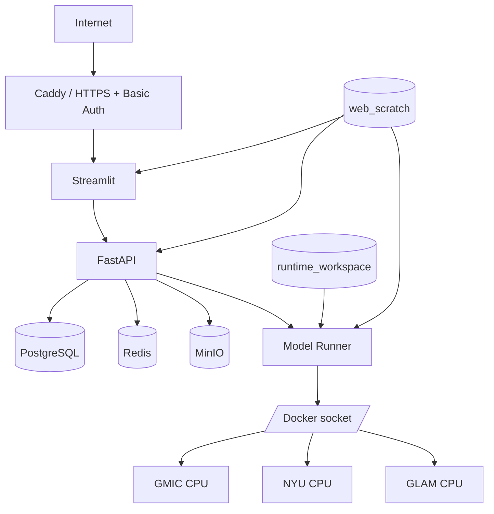

# Perfil productivo CPU para VPS — v0.36.0

## Objetivo

Este perfil permite desplegar la Web validada sin reconstruir el proyecto ni los modelos en el VPS. La lógica de inferencia Web y Batch se conserva. El cambio está limitado al empaquetado y a la topología de despliegue.

El VPS necesita únicamente Docker Engine/Compose, el bundle de deployment y credenciales de Docker Hub. El código de aplicación, configuración, Caddy, Model Runner y el runtime ya resuelto se distribuyen como imágenes Docker.



## Qué se empaqueta en contenedores

- `mammography-agent-app`: mismo código v0.36.0 usado por FastAPI, Streamlit y bootstrap.
- `mammography-agent-model-runner`: Model Runner con la configuración validada y Docker CLI.
- `mammography-agent-edge`: Caddy con el Caddyfile productivo.
- `mammography-runtime-assets`: snapshot del `mammography_metarepository` ya resuelto y de `workspace/models` necesario para conservar metadata de compatibilidad.
- Imágenes GMIC/NYU/GLAM `research`: inferencia CPU.
- Imágenes GMIC/NYU/GLAM `blackwell-cu128`: se mantienen porque el orientation preflight actual prefiere el runtime de compatibilidad validado incluso cuando el preprocessing se ejecuta en CPU.

No se empaquetan datasets RSNA/CMMD/CBIS, resultados Batch ni estudios Web.

## Eliminación de bind mounts de carpetas del host

El Compose de investigación usa `HOST_WORKSPACE:/workspace`. El perfil productivo no lo necesita. Reemplaza esa carpeta por un volumen Docker nombrado:

```text
mammography-runtime-workspace
```

La imagen `mammography-runtime-assets` lo inicializa una sola vez. Los contenedores temporales GMIC/NYU/GLAM continúan usando `--volumes-from mammography-workspace-anchor`, por lo que el contrato interno `/workspace` no cambia.

El único bind mount del host que permanece es:

```text
/var/run/docker.sock:/var/run/docker.sock
```

Es necesario porque el Model Runner conserva el mecanismo validado de crear los contenedores efímeros de los modelos en el Docker Engine del host.

Los datos durables se guardan en volúmenes Docker:

```text
mammography-postgres-data
mammography-minio-data
mammography-runtime-workspace
mammography-caddy-data
mammography-caddy-config
```

El scratch Web usa:

```text
mammography-web-scratch
```

y continúa siendo transitorio.

## Preparación única en la workstation validada

### 1. Crear `.env.production`

```bash
cp deployment/production/.env.production.example deployment/production/.env.production
```

Tiempo estimado: menos de 5 segundos.

Cambiar todos los valores `CHANGE_ME`.

### 2. Generar password hash para Caddy

```bash
./scripts/production/generate-basic-auth-hash.sh
```

Tiempo estimado: 5–30 segundos, principalmente por la descarga inicial de la imagen Caddy si aún no existe localmente.

Copiar la línea resultante a `.env.production`. El hash debe quedar entre comillas simples para evitar interpolación de `$` por Docker Compose.

### 3. Publicar las imágenes de modelos ya validadas

No se reconstruyen.

Blackwell:

```bash
./scripts/production/publish-existing-model-images.sh deployment/production/.env.production blackwell
```

Tiempo estimado: desde varios minutos hasta más de una hora por primera carga, según ancho de banda y capas ya presentes en Docker Hub.

CPU/research:

```bash
./scripts/production/publish-existing-model-images.sh deployment/production/.env.production cpu
```

Tiempo estimado: desde varios minutos hasta más de una hora por primera carga.

### 4. Publicar imágenes de plataforma y runtime

```bash
./scripts/production/publish-platform-images.sh deployment/production/.env.production
```

Tiempo estimado: 5–30 minutos para app/runner/edge, más el tiempo de empaquetar/subir el runtime. Depende del tamaño real del metarepository y del ancho de banda.

Este script empaqueta únicamente:

```text
workspace/runtime/mammography_metarepository
workspace/models
```

No incluye datasets ni resultados experimentales.

El empaquetado de `workspace/models/compatibility/*-gpu.json` es intencional: evita que el Model Runner interprete una revisión Blackwell validada como inexistente y reconstruya GMIC/GLAM en el VPS.

### 5. Registrar digests

```bash
./scripts/production/lock-production-images.sh deployment/production/.env.production
```

Tiempo estimado: segundos a varios minutos si las imágenes ya están descargadas; mayor si alguna debe descargarse.

## Despliegue en el VPS

El VPS no necesita el repositorio fuente completo ni un `workspace/` del host.

### 1. Copiar el bundle de deployment

Descomprimir el bundle entregado, por ejemplo en:

```text
/opt/mammography-prod
```

### 2. Crear `.env.production`

```bash
cp deployment/production/.env.production.example deployment/production/.env.production
```

Tiempo estimado: menos de 5 segundos.

Usar los mismos nombres de imágenes publicados y generar secretos propios del VPS.

### 3. Login de Docker Hub

```bash
docker login
```

Tiempo estimado: 10–60 segundos.

Se recomienda usar un token de acceso de Docker Hub para el servidor.

### 4. Validar configuración

```bash
./scripts/production/validate-production-config.sh deployment/production/.env.production
```

Tiempo estimado: menos de 10 segundos.

### 5. Pull + despliegue

```bash
./scripts/production/deploy-production.sh deployment/production/.env.production
```

Tiempo estimado inicial: principalmente el tiempo necesario para descargar las imágenes. Con más de 40 GB entre runtimes/modelos puede tardar decenas de minutos o varias horas según la red. Los siguientes despliegues reutilizan capas locales.

El script ejecuta:

1. validación de Compose;
2. pull de app, runner, edge, runtime, PostgreSQL, Redis y MinIO;
3. pull de las seis imágenes de modelos;
4. creación de aliases locales exactos esperados por `config/models.yaml`;
5. `docker compose up -d`.

No ejecuta `docker build` en el VPS.

## Puertos

Solo Caddy publica puertos:

```text
80/tcp
443/tcp
443/udp
```

FastAPI, Streamlit, Model Runner, PostgreSQL, Redis y MinIO no publican puertos al host.

## CPU-only

El perfil productivo fija:

```text
DEFAULT_MODEL_DEVICE=cpu
GMIC_DEVICE=cpu
NYU_DEVICE=cpu
GLAM_DEVICE=cpu
ALLOW_GPU=false
WEB_INFERENCE_DEVICE=cpu
```

No se modificó la interfaz ni el contrato de inferencia Web. En este perfil debe mantenerse CPU como dispositivo seleccionado.

## Dominio y HTTPS

Para una prueba inicial por IP puede mantenerse:

```env
APP_SITE_ADDRESS=:80
```

Cuando el DNS apunte al VPS se recomienda configurar, por ejemplo:

```env
APP_SITE_ADDRESS=mamografia.ejemplo.com
```

Caddy obtendrá y renovará HTTPS automáticamente cuando el dominio y los puertos estén correctamente configurados.

## Actualizaciones

No ejecutar:

```bash
docker compose down -v
```

para una actualización normal. Los volúmenes nombrados contienen PostgreSQL, MinIO, runtime y certificados.

Para actualizar imágenes:

```bash
./scripts/production/deploy-production.sh deployment/production/.env.production
```

El volumen `runtime_workspace` no es sobrescrito automáticamente si ya fue inicializado. Una nueva versión de runtime debe tratarse como una migración explícita, no como una copia silenciosa.

## Invariantes preservados

- No se modificó `single_case.py`.
- No se modificó `pipeline.py`.
- No se modificó `orientation_policy.py`.
- No se modificó `soft_voting.py`.
- No se modificó `ui/streamlit_app.py`.
- No se modificó `api.py`.
- Los YAML de modelos/ensemble/experimentos conservan su contenido.
- No se modifica el flujo Batch.
- No se modifica el cálculo GMIC/NYU/GLAM/ensemble.
- No se modifica el comportamiento de PostgreSQL/MinIO de la Web.

La única modificación dentro de `model_runner/api.py` es el identificador de versión `0.35.3 -> 0.36.0`; la lógica del runner permanece igual.
